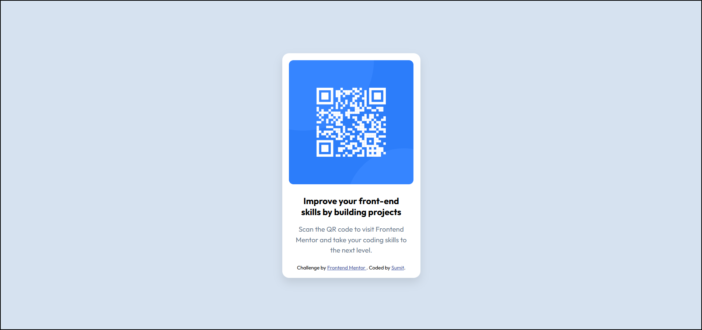
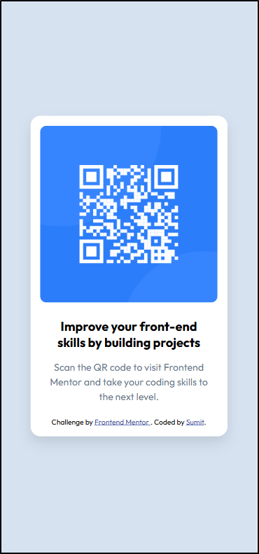

<<<<<<< HEAD
# Frontend Mentor - QR Code Component

This is my solution to the QR Code Component challenge from Frontend Mentor.

## Overview

### Desktop Preview

### Mobile Preview

## Links

- Live Site: https://transcendent-malasada-903bff.netlify.app/
- Repository: https://github.com/KylarSec/frontend-mentor-qr-code

## Built With

- HTML5
- CSS3
- Flexbox
- Responsive Design

## What I Learned

Through this project, I practiced:

- Flexbox centering
- Responsive layouts using `max-width`
- Image scaling with `width: 100%`
- Building a simple responsive card component

## Author

- GitHub: KylarSec
=======
# frontend-mentor-qr-code
>>>>>>> fee8a2f4e594d602852a95d8a255d7a471502f52
